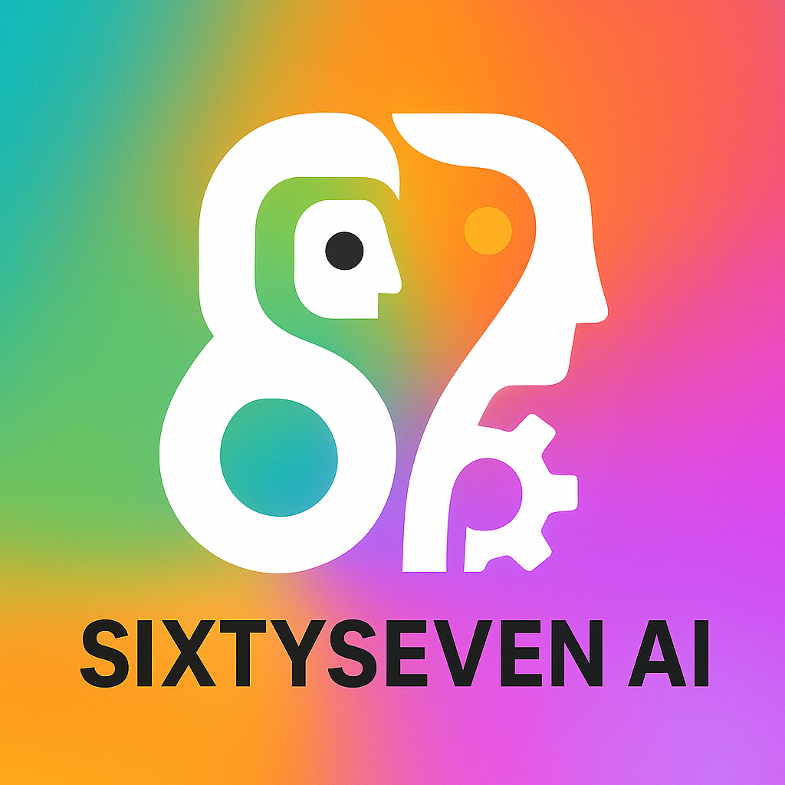

# AGENT.md

**SixtySeven AI – Core Agent Contract**

## 1. Platform Identity (Non-Negotiable)

SixtySeven AI is **not a course website**.
It is a **Skill Game Engine**.

All features must support:

* Games
* Levels
* Quests
* XP
* Badges
* Powers
* Player progression

No "blog-style" or "course-style" UX is allowed.

---

## 2. UI Zones (Must Remain Separate)

There are two permanent universes:

| Zone                 | Purpose                                |
| -------------------- | -------------------------------------- |
| Power Up             | Discovery, trending, featuring content |
| GAMES                | Skill progression engine               |

They must never mix.

---

## 3. Brand Colors & Gradients (Lock These)

### PRIMARY BRAND GRADIENT: Neural Spectrum

| Color             | Hex       | Role                 |
| ----------------- | --------- | -------------------- |
| Human Teal        | `#26E6C8` | Learning / Curiosity |
| Intelligence Blue | `#2A8CFF` | Trust / Logic        |
| Builder Violet    | `#7B3FE4` | Depth / Systems      |
| Growth Pink       | `#FF4FD8` | Energy / Creativity  |
| Momentum Orange   | `#FF8A00` | Action / Power       |

### CORE BRAND COLORS

| Role                | Color         | Hex       |
| ------------------- | ------------- | --------- |
| Primary Dark (Text) | Neural Navy   | `#0F172A` |
| Primary Light       | Pure White    | `#FFFFFF` |
| Surface Gray        | Soft Graphite | `#E5E7EB` |
| System Black        | Void Black    | `#000000` |

### ACTION COLORS

| Action        | Color             | Hex       |
| ------------- | ----------------- | --------- |
| Primary CTA   | Momentum Orange   | `#FF8A00` |
| Secondary CTA | Intelligence Blue | `#2A8CFF` |
| Success       | Neural Green      | `#22C55E` |
| Secondary Success | Vibrant Purple | `#A855F7` |
| Warning       | Signal Yellow     | `#FACC15` |
| Error         | Alert Red         | `#EF4444` |

### UI BACKGROUND SYSTEM

| Usage           | Color         | Hex       |
| --------------- | ------------- | --------- |
| Main Background | Pure White    | `#FFFFFF` |
| Dark Mode       | Neural Navy   | `#0F172A` |
| Cards           | Soft Snow     | `#F9FAFB` |
| Borders         | Soft Graphite | `#E5E7EB` |

### GRADIENT PRESETS

| Usage          | CSS                                                                    |
| -------------- | ---------------------------------------------------------------------- |
| Brand          | `linear-gradient(135deg, #26E6C8, #2A8CFF, #7B3FE4, #FF4FD8, #FF8A00)` |
| XP Bars        | `linear-gradient(90deg, #2A8CFF, #FF8A00)`                             |
| Boss Levels    | `linear-gradient(135deg, #0F172A, #000000)`                            |
| Unlock Effects | `linear-gradient(90deg, #FF8A00, #26E6C8)`                             |
| Hero Sections  | `linear-gradient(135deg, #26E6C8, #2A8CFF, #7B3FE4)`                   |
| CTA Buttons    | `linear-gradient(90deg, #FF8A00, #FF4FD8)`                             |

### COLOR USAGE RULES

* All logos use **dark, saturated versions** of brand colors
* Minimum contrast ratio: **4.5:1** against any background
* Never use light, washed-out, or pastel variations
* Neural Spectrum gradient only (all 5 colors in sequence)
* Never lighten brand colors for "modern" aesthetics
* Never use dull corporate blues or pale palettes
* Always use gradient for "AI" zones
* Flat colors for text/UI clarity
* No additional colors without design lead approval

---

## 4. Card System (Mandatory)

All content must render as cards.

| Card Type  | Rule                                         |
| ---------- | -------------------------------------------- |
| Game Card  | Gradient background, glow, START button      |
| Level Card | Navy background, XP bar, lock states         |
| Quest Card | Black background, dashed cyan border         |
| Boss Card  | Black→Navy gradient, gold border, glow pulse |

---

## 5. XP & Progression Engine (Core Logic)

| Action            | XP      |
| ----------------- | ------- |
| Quest Complete    | 100–200 |
| Boss Mission      | 400     |
| Level Completion  | +250    |
| 7-Day Streak      | +500    |
| Portfolio Publish | +1000   |

Total graduation XP: **10,500**

---

## 6. Typography (Lock)

| Use      | Font           |
| -------- | -------------- |
| Headings | Space Grotesk  |
| UI       | Inter          |
| Numbers  | JetBrains Mono |

---

## 7. Experience Law (Core Design Philosophy)

Every game element must:

* Produce something real
* Increase player power
* Unlock visible abilities
* Create portfolio output
* Feel like forward progress
* Reinforce the game/skill progression narrative

UI elements must include game visual language: glows, gradients, badges, XP bars.
Boss levels, level locks, and progression states must be visible at all times.
Even discovery zones (read/audio/video) must have subtle game styling.

**No passive watching. No educational/course-like layouts. Theme violations are bugs.**

---

## 8. Naming Rules

Never use:

* Course
* Lesson
* Chapter
* Module

Always use:

* Game
* Level
* Quest
* Boss
* Power

---

## 9. Design Authority

If any future change conflicts with this file, **this file wins.**

---

## 10. Homepage Layout Grid

The homepage is the entry point to the platform—it must immediately communicate the game structure and drive navigation into either Power Up or GAMES zones.

### Grid Structure (Desktop: 12-column, Mobile: 4-column, Tablet: 8-column)

| Section      | Grid Span | Height   | Purpose                                      |
| ------------ | --------- | -------- | -------------------------------------------- |
| Hero Zone    | Full      | 60vh     | Neural Spectrum gradient, headline, "START"  |
| Identity Block | Full    | Auto     | What is SixtySeven (not course, is skill-forging) |
| Games Hub    | Full      | Auto     | 5 game cards in responsive grid (1–2–5 layout) |
| Core Pillars | Full      | Auto     | 3 pillar cards: Game-Structured, AI-Native, Real Power |
| CTA Zone     | Full      | 40vh     | Dark hero section with final call-to-action  |

### Hero Zone Specifications

**Background**: Neural Spectrum gradient (`linear-gradient(135deg, #26E6C8, #2A8CFF, #7B3FE4, #FF4FD8, #FF8A00)`)

**Text**: 
- Headline: Space Grotesk, 64px (desktop), bold, Neural Navy (#0F172A)
- Subheadline: Inter, 24px, Neural Navy
- CTA Button: Gradient background (`linear-gradient(90deg, #FF8A00, #FF4FD8)`), white text, 18px Inter bold, min 48px height, glow effect

**Layout**: Center-aligned, 80% max-width, 60px padding top/bottom

### Identity Block Specifications

**Background**: Pure White (#FFFFFF)

**Grid**: 2 columns (desktop), 1 column (mobile)

**Content Left**: 
- Headline: "This is not a course platform. This is a skill-forging engine."
- Body: 3–4 sentences differentiating SixtySeven
- Font: Space Grotesk (headline), Inter (body)
- Color: Neural Navy (#0F172A)

**Content Right**:
- Table: Traditional Learning vs SixtySeven AI (6 rows)
- Use monospace (JetBrains Mono) for comparison items
- Left column: dim gray (#999), right column: Intelligence Blue (#2A8CFF)

**Spacing**: 80px padding, 40px column gap

### Games Hub Grid

**Background**: Soft Snow (#F9FAFB)

**Layout**: 5 game cards responsive (5 cols on desktop, 2 cols tablet, 1 col mobile)

**Card Grid**: Max 1200px width, centered, 20px gap

**Padding**: 60px top/bottom, 40px sides

---

## 11. Games Hub Card System

Each game card must signal progression potential and drive action into the game.

### Game Card Anatomy

| Element        | Spec                                                |
| -------------- | --------------------------------------------------- |
| Background     | Gradient based on game (custom per game)            |
| Border         | 2px solid, gradient (90deg variation of background) |
| Border Radius  | 12px                                                |
| Padding        | 32px                                                |
| Min Height     | 280px                                               |
| Glow Effect    | `box-shadow: 0 0 30px rgba(255, 143, 0, 0.3)` (orange-tinted) |
| Hover State    | Scale 1.05, glow brightens, shadow deepens         |

### Game Card Layout (Vertical Stack)

```
┌─────────────────────┐
│  [Game Icon]        │  (32x32, centered)
├─────────────────────┤
│  Game Title         │  (Space Grotesk, 24px, bold, Neural Navy)
├─────────────────────┤
│  Description        │  (Inter, 14px, Neural Navy, 2 lines max)
├─────────────────────┤
│  XP Badge           │  (Vibrant Purple bg, white text, 12px monospace)
│  "Total XP: 2,500"  │
├─────────────────────┤
│  [START BUTTON]     │  (Full width, gradient CTA, 48px height)
└─────────────────────┘
```

### Per-Game Gradient & Color

| Game              | Gradient                                          | Icon Color      |
| ----------------- | ------------------------------------------------- | --------------- |
| Prompt Architect  | `linear-gradient(135deg, #26E6C8, #2A8CFF)`      | Human Teal      |
| Agent Engineer    | `linear-gradient(135deg, #2A8CFF, #7B3FE4)`      | Intelligence Blue |
| Automation Forge  | `linear-gradient(135deg, #7B3FE4, #FF4FD8)`      | Builder Violet  |
| Creator OS        | `linear-gradient(135deg, #FF4FD8, #FF8A00)`      | Growth Pink     |
| Startup Builder   | `linear-gradient(135deg, #FF8A00, #26E6C8)`      | Momentum Orange |

### Badge System (XP Display)

**Position**: Top-right corner of card, absolute positioned

**Style**:
- Background: Vibrant Purple (#A855F7)
- Text: Pure White (#FFFFFF)
- Font: JetBrains Mono, 11px
- Padding: 8px 12px
- Border Radius: 6px
- Content: `XP: [number]` (total game XP)

### START Button (CTA)

**Style**:
- Background: Gradient (`linear-gradient(90deg, #FF8A00, #FF4FD8)`)
- Text: Pure White, Inter 16px bold
- Height: 48px
- Border: None
- Border Radius: 6px
- Cursor: pointer
- Glow on hover: `box-shadow: 0 0 20px rgba(255, 143, 0, 0.5)`

**Interaction**: Click → Navigate to `/games/[game-slug].html`

### Responsive Behavior

| Breakpoint | Columns | Card Width | Gap  |
| ---------- | ------- | ---------- | ---- |
| Desktop    | 5       | Auto       | 20px |
| Tablet     | 2       | Auto       | 16px |
| Mobile     | 1       | Full       | 12px |

---

## 12. Level 1 Onboarding Flow

When a player enters a game, Level 1 must hook them immediately, establish game rules, and deliver their first win within 5 minutes.

### Level 1 Container Specs

**Background**: Dark Mode (Neural Navy #0F172A) with subtle grid pattern

**Layout**: Center container, max-width 900px, 60px padding

**Typography**: Space Grotesk headings, Inter body text, all text Pure White (#FFFFFF)

### Level 1 Flow (4 Screens)

#### Screen 1: Level Intro

```
┌─────────────────────────────────┐
│  LEVEL 1: [Game-Specific Name]  │  (Space Grotesk, 48px)
│  The Foundation                 │  (Subheadline, 24px)
├─────────────────────────────────┤
│  [32x32 Level Icon]             │
├─────────────────────────────────┤
│  Description (2–3 sentences)    │  (Inter, 16px, #E5E7EB)
│  What you'll build & unlock     │
├─────────────────────────────────┤
│  [NEXT → Button]                │  (CTA Gradient)
└─────────────────────────────────┘

Duration: Auto-advance after 3s or click NEXT
```

#### Screen 2: Mission Brief

```
┌─────────────────────────────────┐
│  YOUR MISSION                   │  (Space Grotesk, 32px)
├─────────────────────────────────┤
│  [Mission Icon]                 │
├─────────────────────────────────┤
│  Primary Task                   │  (Inter, 18px bold)
│  [Checkbox] Subtask 1           │
│  [Checkbox] Subtask 2           │
│  [Checkbox] Subtask 3           │
├─────────────────────────────────┤
│  XP REWARD: 100 XP              │  (JetBrains Mono, Momentum Orange)
│  [ACCEPT MISSION →]             │  (CTA Gradient)
└─────────────────────────────────┘

Interaction: Checkboxes are visual only; cannot be checked yet
```

#### Screen 3: Tutorial / First Action

```
┌─────────────────────────────────┐
│  YOUR FIRST POWER-UP            │  (Space Grotesk, 32px)
├─────────────────────────────────┤
│  [Video/GIF: 4-second demo]     │  (Max 640px width)
├─────────────────────────────────┤
│  Guided Action (Game-Specific)  │  (Inter, 16px)
│  Click the orange button below  │
│  or fill the form               │
├─────────────────────────────────┤
│  [Primary Interactive Element]  │  (Styled per game)
│  [Helper Text / Tooltip]        │
└─────────────────────────────────┘

Interaction: Player completes the first real task
```

#### Screen 4: Completion & Unlock

```
┌─────────────────────────────────┐
│  MISSION COMPLETE 🎮            │  (Space Grotesk, 40px)
├─────────────────────────────────┤
│  +100 XP                        │  (Animated: fly from center, JetBrains Mono, 32px)
│  [Progress Bar: 100/1000]       │  (XP Bar gradient, smooth animation)
├─────────────────────────────────┤
│  POWER UNLOCKED:                │  (Space Grotesk, 24px)
│  [Power Icon] [Power Name]      │  (Vibrant Purple badge)
├─────────────────────────────────┤
│  Next Level Available           │
│  [PLAY LEVEL 2 →]              │  (CTA Gradient, primary button)
│  [View Leaderboard]             │  (Secondary link)
└─────────────────────────────────┘

Animation: XP counter animates up, progress bar fills, power badge glows
```

### Level 1 Timing & Progression

| Screen | Duration      | Trigger                    |
| ------ | ------------- | -------------------------- |
| 1      | 3s auto / tap | Auto-advance or click NEXT |
| 2      | Until click   | ACCEPT MISSION button      |
| 3      | Until task    | Complete the interactive element |
| 4      | 4s auto       | Auto-advance to Level 2 or stay for celebration |

### Game-Specific Level 1 Variations

Each game's Level 1 must customize **Screen 3** and the **mission definition**:

| Game             | Screen 3 Task                               | Output                |
| ---------------- | ------------------------------------------- | --------------------- |
| Prompt Architect | Write a 3-sentence system prompt            | Prompt string         |
| Agent Engineer   | Define an agent's goal in 1 sentence        | Goal definition       |
| Automation Forge | Connect 2 tools via a workflow diagram      | Visual workflow       |
| Creator OS       | Build a 5-step content outline              | Outline list          |
| Startup Builder  | Define your AI product in 2 sentences       | Product statement     |

### Level 1 XP Rewards (Override Section 5)

| Completion         | XP    |
| ------------------ | ----- |
| Level 1 Complete   | 100   |
| Bonus: Sub-3min    | +25   |
| Bonus: Perfect     | +50   |
| **Total L1 Max**   | **175** |

### Lock States & Visibility Rules

**During Level 1**:
- All future levels appear as **LOCKED** (Navy background, 30% opacity)
- Locked level cards show lock icon, "Level 2" text, no progress bar
- Leaderboard shows only Level 1 entries

**After Level 1 Complete**:
- Level 2 becomes **AVAILABLE** (full color, clickable)
- XP bar updates globally
- Badge "Level 1 Player" appears on profile

---

## 13. Mobile & Responsive Design (All Pages)

All pages must be fully responsive and mobile-friendly across all breakpoints.

### Breakpoints & Grid

**Tailwind Breakpoints**:
- `sm`: 640px (small phones)
- `md`: 768px (tablets)
- `lg`: 1024px (large tablets/desktops)
- `xl`: 1280px (full desktops)

### Navigation (Mobile-First)

**Mobile (< 768px)**:
- Logo: `h-8` (28px)
- Navigation links: Hidden
- Mobile menu toggle button: Visible (hamburger icon)
- Gap: `gap-2` minimal spacing
- Padding: `px-3 py-3` reduced

**Tablet (md, 768px+)**:
- Logo: `h-12` (48px)
- Navigation links: Visible
- Mobile menu toggle: Hidden
- Gap: `gap-6 md:gap-12` increases
- Padding: `px-6 py-4`

**Desktop (lg+)**:
- Logo: `h-16 md:h-20` (64-80px)
- Full navigation visible
- Gap: `lg:gap-8` generous spacing
- Font: `lg:text-sm` larger readable text

### Typography Scaling

All headings must use `clamp()` or responsive classes:

```
Heading Patterns:
- Mobile: text-3xl
- Tablet (sm): text-4xl
- Desktop (md): text-5xl
- Large (lg): text-6xl
```

Example: `<h1 class="text-3xl sm:text-4xl md:text-5xl lg:text-6xl">`

Body text: Always responsive
- Mobile: `text-sm sm:text-base md:text-lg`
- Default: DO NOT use `text-lg` directly on mobile

### Spacing Consistency

**Padding (Sections)**:
- Mobile: `px-4 py-12` or `px-4 py-16`
- Tablet: `sm:px-6 sm:py-16` or `sm:py-20`
- Desktop: `md:py-24` for large sections

**Gaps (Grids)**:
- Mobile: `gap-2` or `gap-3` (minimal)
- Tablet: `sm:gap-4` or `sm:gap-6`
- Desktop: `lg:gap-5` or `lg:gap-8`

**Margins**: Follow gap patterns, scale vertically

### Cards & Grids (Mobile-First)

**Standard Layout**:
```
Mobile: grid-cols-1 (full width)
Tablet: sm:grid-cols-2 (2 columns)
Desktop: lg:grid-cols-3 xl:grid-cols-5 (5 columns max)
```

Example 5-column grid:
```html
<div class="grid grid-cols-1 sm:grid-cols-2 lg:grid-cols-3 xl:grid-cols-5 gap-3 sm:gap-4 lg:gap-5">
```

Card padding scales with breakpoint:
```html
<div class="p-4 sm:p-6 md:p-8">
```

### Mobile Menu Pattern

All pages must implement:

1. **Toggle Button** (hidden on md+):
```html
<button id="mobile-menu-toggle" class="md:hidden p-2 rounded-lg bg-gray-700/40" aria-label="Toggle mobile menu">
    <svg class="w-5 h-5 text-white"><!-- hamburger icon --></svg>
</button>
```

2. **Navigation Links** (hidden on mobile, shown on md+):
```html
<div class="hidden md:flex gap-4 lg:gap-8 items-center">
    <!-- nav links -->
</div>
```

3. **JavaScript Handler**:
```javascript
const mobileMenuToggle = document.getElementById('mobile-menu-toggle');
mobileMenuToggle.addEventListener('click', () => {
    const navLinks = document.querySelector('.hidden.md\\:flex');
    navLinks.classList.toggle('hidden');
});
```

### Footer Responsiveness

**Mobile**:
- `py-8 px-4` (reduced padding)
- `flex-col` (stacked vertical)
- `gap-4` (tight spacing)
- `text-xs` (small text)

**Desktop**:
- `sm:py-10 sm:px-6` (increase padding)
- `sm:flex-row` (side-by-side)
- `sm:gap-6` (loose spacing)
- `sm:text-base` (readable)

### Buttons & CTAs (Mobile-First)

Button padding scales:
```html
<button class="py-3 px-6 sm:py-4 sm:px-8 text-base sm:text-lg">
```

CTA buttons minimum height: **48px** on all devices
Touch targets (mobile): Minimum **44px × 44px**

### Images & Media Responsive

All images must have `max-width` on mobile:
```html

<video style="max-width: 100%;">
```

Hero heights responsive:
```html
<section class="min-h-screen md:min-h-[60vh]">
```

### Tables (Mobile-Friendly)

Tables must NOT overflow on mobile:

```html
<div class="overflow-x-auto">
    <table class="w-full text-sm sm:text-base">
        <!-- table content -->
    </table>
</div>
```

Reduce table font on mobile to prevent overflow:
- Mobile: `text-xs` or `text-sm`
- Desktop: `text-base`

### Testing & QA Checklist

Before shipping any page:

- [ ] Mobile (375px): No horizontal scroll, readable text, tappable buttons
- [ ] Tablet (768px): Proper 2-column layouts, images scale
- [ ] Desktop (1024px+): 3-5 column grids, full feature set
- [ ] Touch targets: All buttons ≥ 44px
- [ ] Legibility: Text readable at all sizes
- [ ] Navigation: Menu toggle works, links accessible
- [ ] Spacing: No overlapping elements at any breakpoint
- [ ] Dark mode: All text visible in both themes
- [ ] Performance: Images optimized, no layout shifts

### Logo Sizing Reference

Consistent logo sizing across breakpoints:

```html

```

- Mobile: 32px
- Tablet: 48px
- Small desktop: 64px
- Large desktop: 80px

---

## TODO: Future Sections

- Component naming conventions
- Folder architecture for developers
